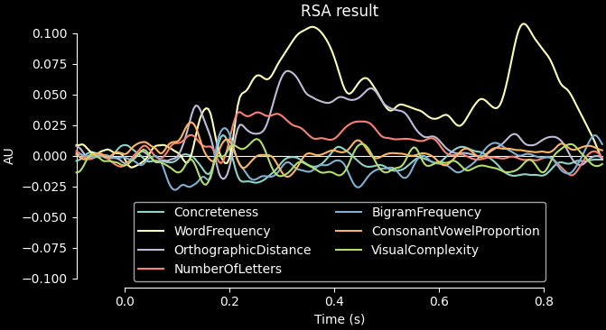

MNE-RSA
-------

This is a Python package for performing representational similarity analysis (RSA) using
`MNE-Python <https://martinos.org/mne/stable/index.html>`__ data structures.
The main use-case is to perform RSA using a “searchlight” approach through time and/or a
volumetric or surface source space.

Read more on RSA in the paper that introduced the technique:

Nikolaus Kriegeskorte, Marieke Mur and Peter Bandettini (2008). Representational
similarity analysis - connecting the branches of systems neuroscience. Frontiers in
Systems Neuroscience, 2(4).
https://doi.org/10.3389/neuro.06.004.2008

.. image:: rsa.png
   :width: 600
   :class: only-light

.. image:: rsa_dark.png
   :width: 600
   :class: only-dark

Use cases
^^^^^^^^^

This is what the package can do for you:

-  Compute RDMs on arbitrary data
-  Compute RDMs in a searchlight across:

   -  vertices/voxels and samples (source level)
   -  sensors and samples (sensor level)
   -  vertices/voxels only (source level)
   -  sensors only (sensor level)
   -  samples only (source and sensor level)

-  Use cross-validated distance metrics when computing RDMs
-  And of course: compute RSA between RDMs

Supported metrics for comparing RDMs:

-  Spearman correlation (the default)
-  Pearson correlation
-  Kendall’s Tau-A
-  Linear regression (when comparing multiple RDMs at once)
-  Partial correlation (when comparing multiple RDMs at once)

Installation
^^^^^^^^^^^^

The package can be installed either through PIP: ``pip install mne-rsa``

or through conda using the conda-forge channel: ``conda install -c conda-forge mne-rsa``

Installing through either channel will pull in `MNE-Python <https://mne.tools>`__ as a dependency, along with `Qt 6] <https://www.qt.io>`__, `PyVista <https://pyvista.org>`__ and `Scikit-Learn <https://scikit-learn.org>`__. See `requirements.txt <https://github.com/mne-tools/mne-rsa/blob/main/requirements.txt>`__ for the full list of packages.

Example usage
^^^^^^^^^^^^^

Basic example of performing RSA on the EEG “kiloword” data using a sliding window across
time:

.. code:: python

   import mne
   import mne_rsa
   data_path = mne.datasets.kiloword.data_path(verbose=True)
   epochs = mne.read_epochs(data_path / "kword_metadata-epo.fif")
   # Create model RDMs based on each stimulus property
   columns = epochs.metadata.columns[1:]  # Skip the first column: WORD
   model_rdms = [mne_rsa.compute_rdm(epochs.metadata[col], metric="euclidean") for col in columns]
   # Perform RSA in a sliding window across time
   rsa_results = mne_rsa.rsa_epochs(epochs, model_rdms, temporal_radius=0.01)
   # Plot the result
   mne.viz.plot_compare_evokeds({column: result for column, result in zip(columns, rsa_results)},
                                picks="rsa", legend="lower center", title="RSA result")

.. image:: rsa_result.png
   :width: 600
   :class: only-light

Documentation
^^^^^^^^^^^^^
For a detailed guide on RSA analysis from start to finish on an example dataset, see the `Tutorials <auto_examples/tutorials/index.html>`_.

For quick guides on how to do specific things, see the `Examples <auto_examples/index.html>`_.

Finally, there is the `API reference documentation <api.html>`_.

Integration with other packages
^^^^^^^^^^^^^^^^^^^^^^^^^^^^^^^

The main use-case for this package to perform RSA analysis on EEG and MEG data. Hence,
integration functions with `MNE-Python <https://mne.tools>`__ are provided. There is
also some integration with `nipy <https://nipy.org>`__ for fMRI that should do well in a
`nilearn <https://nilearn.github.io>`__ setup.

Performance
^^^^^^^^^^^

This package aims to be fast and memory efficient. An important design feature is that
under the hood, everything operates on generators. The searchlight routines produce a
generator of RDMs which are consumed by a generator of RSA values. Parallel processing
is also supported, so you can use all of your CPU cores.

Support
^^^^^^^

This free software comes without any form of official support.
However, if you think you have encountered a bug or have a particularly great idea for improvements, please open an `issue on Github <https://github.com/mne-tools/mne-rsa/issues>`_.
For questions and help with your analysis, you are welcome to post on the `MNE forum <https://mne.discourse.group/>`_.

Contributing
^^^^^^^^^^^^

Development of the package happens on `Github <https://github.com/mne-tools/mne-rsa>`__ under the umbrella of MNE-tools.
Everyone is welcome to raise `issues <https://github.com/mne-tools/mne-rsa/issues>`__ or contribute `pull requests <https://github.com/mne-tools/mne-rsa/pulls>`__ as long as they abide by our `Code of Conduct <https://github.com/mne-tools/.github/blob/main/CODE_OF_CONDUCT.md>`__.
For more information about the ways in which one can contribute, see the `Contributing guide of MNE-Python <https://mne.tools/stable/development/contributing.html>`__, which by and large applies to this project as well.

Here is how to install the additional required packages for developing MNE-RSA and set up the package in development mode:

.. code:: bash

   git clone git@github.com:mne-tools/mne-rsa.git
   cd mne-rsa
   pip install -r requirements-dev.txt
   pip install -e .

To run the test suite, execute ``pytest`` in the main ``mne-rsa`` folder.  
To build the documentation, execute ``make html`` in the ``mne-rsa/doc`` folder (or on
Windows: ``sphinx-build . _build/html``).

Citation
^^^^^^^^
If you end up using this package for the data analysis that is part of a scientific
article, please cite:

Marijn van Vliet, Stefan Appelhoff, Takao Shimizu, Egor Eremin, Annika Hultén, Yuanfang Zhao, and Richard Höchenberger, (2025). MNE-RSA: Representational Similarity Analysis on EEG, MEG and fMRI data. Journal of Open Source Software, 10(116), 9148, https://doi.org/10.21105/joss.09148

.. toctree::
   :hidden:

   Tutorials <auto_examples/tutorials/index>
   Examples <auto_examples/index>
   API Reference <api>
