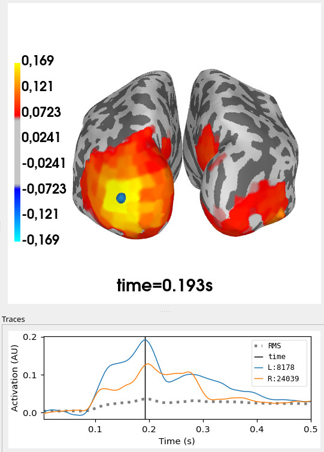

# Summary

MNE-RSA is a Python package for performing representational similarity analysis (RSA) on non-invasive measurements of brain activity, namely electroencephalography (EEG), magnetoencephalography (MEG) and functional magnetic resonance imaging (fMRI).
It serves as an extension to MNE-Python [@Gramfort2013], which is a comprehensive package for preprocessing EEG/MEG data and performing source estimation alongside implementing the many preprocessing steps required for RSA analysis.
After preprocessing is done, MNE-RSA provides a straightforward way to perform the actual RSA on data that is loaded as MNE-Python datastructures.

## About RSA
RSA is a technique to compare information flows within complex systems [@Kriegeskorte2008].
In the context of this software package, this mostly means comparing different representations of input stimuli to neural representations at different locations and times in the brain.
Example representations of a stimulus would be the pixels of an image, the semantic features of the object depicted in the image ("has a tail", "barks", "good boy"), or an embedding vector obtained with a convolutional neural network (CNN) or large language network (LLM) [@Diedrichsen2017].
Example neural representations include the pattern of electric potentials across EEG sensors, the magnetic field pattern across MEG sensors, the pattern of source localized activity across the cortex, or the pattern of beta values across fMRI voxels.
Whenever one can create multiple representations of the same stimuli, one can compare these representations using RSA to judge their "representational similarity" (\autoref{fig:rsa}).
The key to this is the creation of a representational dissimilarity matrix (RDM) which is an all-to-all distance matrix between the representations of a set of stimuli, usually obtained by correlating the representation vectors of each pair of stimuli.
Once an RDM is obtained for the different representation schemes (typically you have one obtained through some model and one obtained from brain activity) they can be compared (again using correlation) to yield an RSA score.
When one does this in a "searchlight" pattern across the brain, the result is a map of RSA scores indicating where and when in the brain the neural representation corresponds to the model.

{width="10cm"}


## Functionality
The core functionality of MNE-RSA consists of an efficient pipeline that operates on NumPy arrays, starting from "searchlight" (i.e. multi-dimensional sliding window) indexing, to cross-validated computation of RDMs, to the comparison with "model" RDMs to produce RSA values.
On top of the general purpose pipeline, MNE-RSA exposes functions that operate on MNE-Python (EEG, MEG) [@Gramfort2013] and Nibabel (fMRI) [@Brett2025] objects and also return the resulting RSA values as such objects.
Those functions leverage the available metadata, such as the sensor layout, edges of cortical 3D meshes, and voxel sizes, to present a more intuitive API.

MNE-RSA supports all the distance metrics in `scipy.spatial.distance` for computing RDMs and the following metrics for comparing RDMs:

-  Spearman correlation (the default)
-  Pearson correlation
-  Kendall’s Tau-A
-  Linear regression (when comparing multiple RDMs at once)
-  Partial correlation (when comparing multiple RDMs at once)

Here is an example showcasing how to use MNE-RSA to perform an RSA analysis between the Wakeman & Nelson "faces" dataset [@Wakeman2015] and FaceNet [@Schroff2015] embedding vectors.
The RSA is performed using a searchlight across the cortical surface and a sliding window across time.
The result is shown in \autoref{fig:rsa-result}.

```python
import os

import mne_rsa
import numpy as np
import pooch
from mne import read_epochs
from mne.minimum_norm import apply_inverse_epochs, read_inverse_operator

# Download the Wakeman & Nelson (2015) “faces” dataset.
pooch.retrieve(
    "https://tinyurl.com/3rr3vb6u",
    known_hash="7c2c1f220b7519798534769e10cabd43690a46dca280729b0fea0599b78d142b",
    processor=pooch.Unzip(extract_dir=os.getcwd()),
)

# Use FaceNet embeddings to compute the model RDM.
facenet = np.load("./data/stimuli/facenet_embeddings.npz")
model_rdm = mne_rsa.compute_rdm(facenet["embeddings"])

# Load MEG epochs and perform source estimation.
epochs = read_epochs("./data/sub-02/sub-02-epo.fif")
inv = read_inverse_operator("./data/sub-02/sub-02-inv.fif")
stcs = apply_inverse_epochs(epochs, inv, lambda2=1 / 9, pick_ori="normal")

# Use MNE-RSA to perform RSA analysis using a seachlight.
stc_rsa = mne_rsa.rsa_stcs(
    stcs,  # data to perform RSA on
    model_rdm,  # model RDM
    labels_stcs=epochs.metadata.file,  # align epochs and embedding vectors
    labels_rdm_model=facenet["filenames"],
    tmin=0,  # restrict the analysis to a time window
    tmax=0.5,
    spatial_radius=0.02,  # use a searchlight across the cortex
    src=inv["src"],  # to compute geodesic distance
    temporal_radius=0.05,  # use a sliding window across time
    verbose=True,  # display a progress bar
    n_jobs=-1,  # use all available CPU cores
)

# Plot the result using MNE-Python.
stc_rsa.plot(
    "sub-02",
    subjects_dir="./data/freesurfer",
    initial_time=0.193,
    hemi="both",
    views="caudal",
    background="white",
)
```
{width="8cm"}


## Performance
Performing RSA in a searchlight pattern will produce tens of thousands of RDMs that can take up multiple gigabytes of space.
For memory efficiency, RDMs are never kept in memory longer than they need to be, hence the useage of Python generators.
It is almost always easier to re-compute RDMs than it is to write them to disk and later read them back in.
The computation of RDMs is parallelized across CPU cores.


# Statement of need

While the core computations behind RSA are simple, getting the details right is hard.
Creating "searchlight" patches across the cortex means using geodesic rather than Euclidean distance (\autoref{fig:distances}), combining MEG gradiometers and magnetometers requires signal whitening, creating proper evoked responses requires averaging across stimulus repetitions, and creating reliable brain RDMs requires cross-validated distance metrics [@Guggenmos2018].
MNE-RSA provides turnkey solutions for all of these details by interfacing with the metadata available in MNE-Python objects.

{width="6cm"}

At the time of writing, MNE-RSA has been used in five studies, two of which involve the authors [@Hulten2021; @Xu2024; @Messi2025; @Ghazaryan2023; @Klimovich-Gray2021].


## Software ecosystem
The scope of MNE-RSA is to to add RSA capabilities to MNE-Python and as such is geared towards users who are analyzing EEG/MEG data in Python.
It provides a streamlined user experience for the most common use cases in this domain.

For users of MATLAB toolboxes such as [FieldTrip](https://www.fieldtriptoolbox.org), [Brainstorm](https://neuroimage.usc.edu/brainstorm) or [EEGLab](https://sccn.ucsd.edu/eeglab), the original [RSA-toolbox](https://github.com/rsagroup/rsatoolbox_matlab) may be a good choice.
The original RSA-toolbox was implemented in MATLAB, although the third iteration now implemented in Python [@Bosch2025].
While its focus is mostly on fMRI analysis, the RSA-toolbox aims for a broad implementation of everything related to RSA and its documentation includes an MEG demo.

A Python package worth mentioning is PyMVPA [@Hanke2009], which implements a wide array of machine learning methods, including an RSA variant where RDMs are created using decoding performance as distance metric.
While it is possible to use it for EEG and MEG analysis, it mostly focuses on fMRI.


# Acknowledgements

Development of MNE-RSA was funded by the Research Council of Finland (grants #310988 and #343385 to M.v.V).

# References
